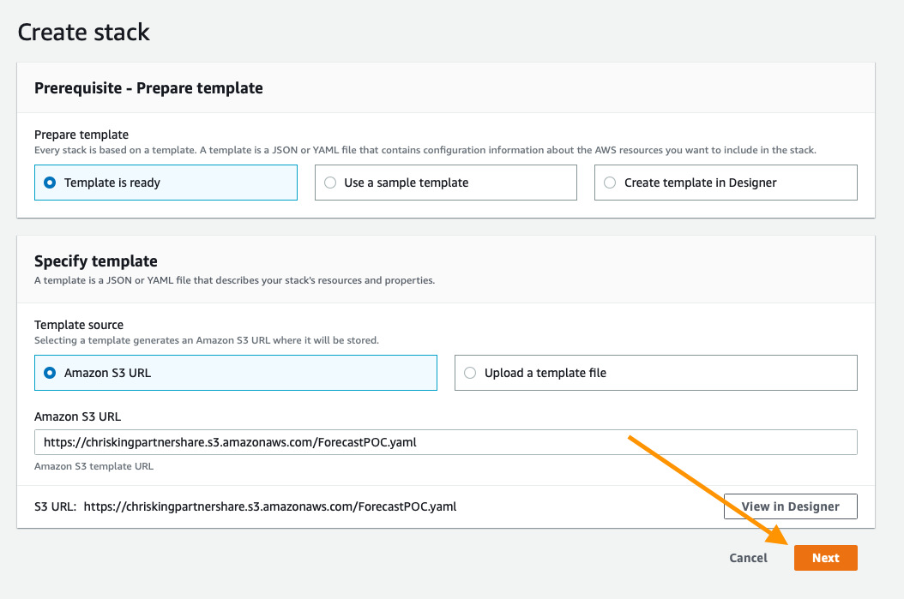
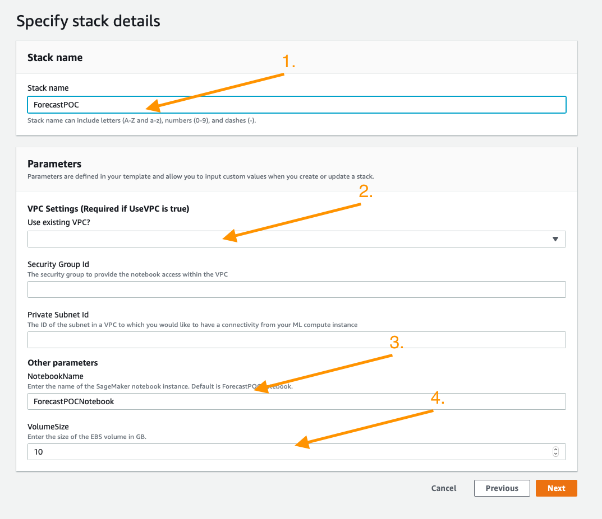
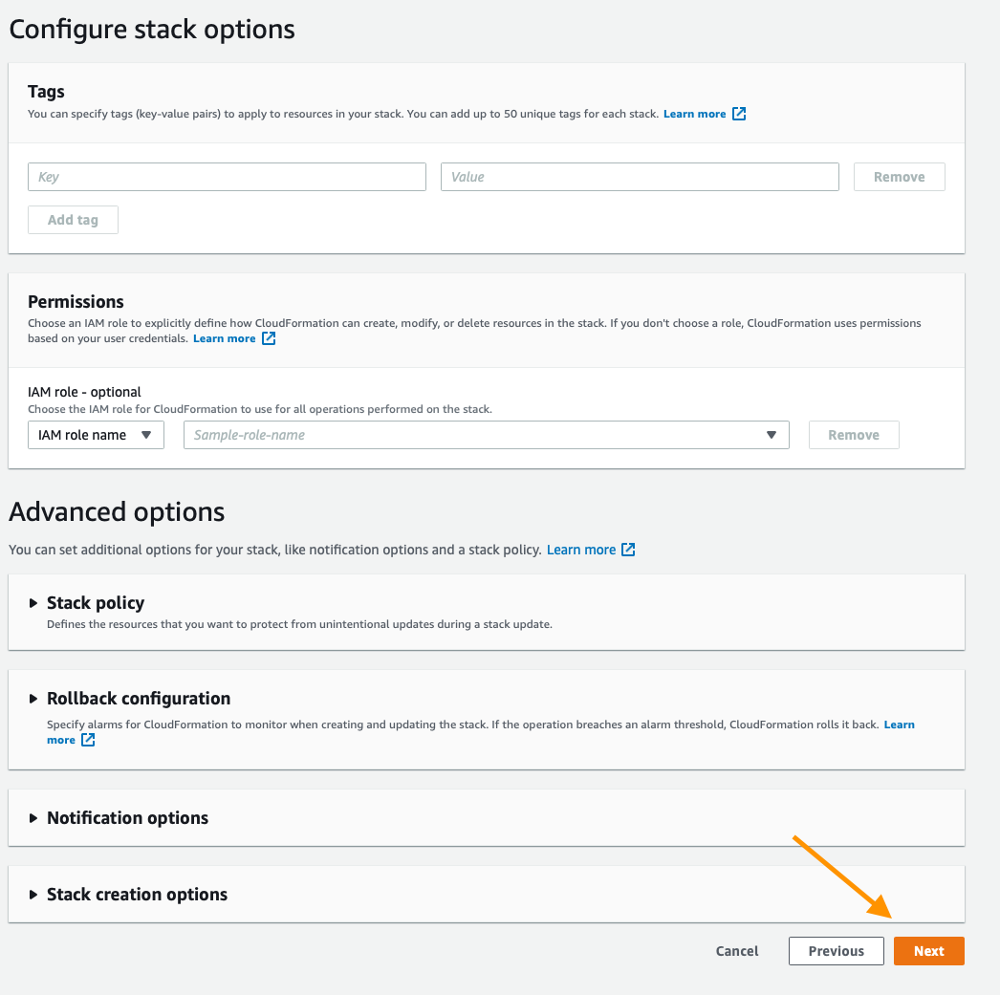
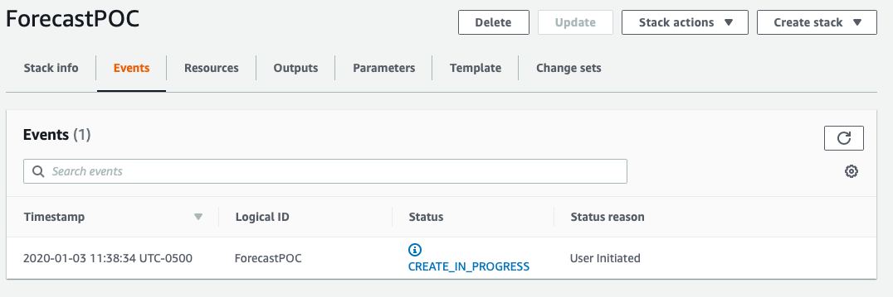
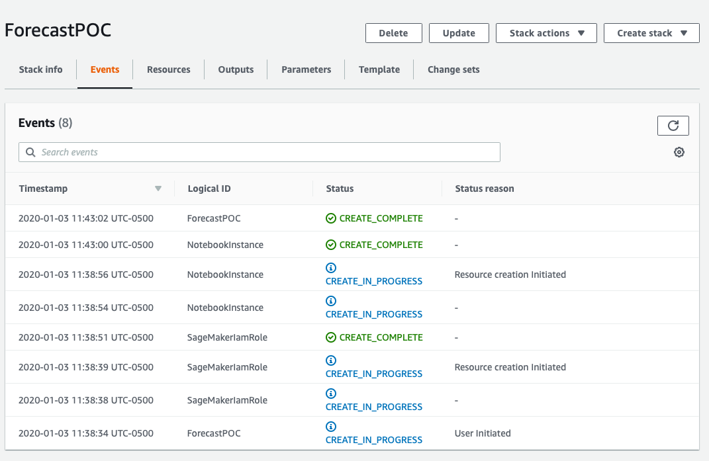
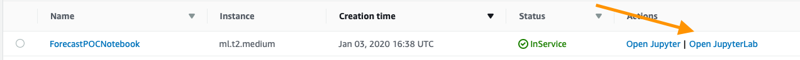

# Amazon Personalize  - A Deep Dive Hands-on Workshop tailored for Data Scientists

###  Amazon Personalize
Matching users to items that they may like sounds like a simple problem. However, the task of developing an efficient recommender system is challenging. Years ago, Netflix even ran a movie recommendation competition with a $1 Million award! 

Indeed, building, optimizing and deploying real-time personalization today requires specialized expertise in analytics, applied machine learning, software engineering, and systems operations. Few organizations have the knowledge, skills, and experience to overcome these challenges, and they either abandon the idea of using recommendation or build under-performing models.

For over 20 years, Amazon.com has built recommender systems at scale, integrating personalized recommendations across the buying experience – from product discovery to checkout.
To help all AWS customers do the same, we announced Amazon Personalize two years ago, a fully-managed service that puts personalization and recommendation in the hands of developers with little machine learning experience.

Personalization offers business benefits such as up to 15% increase in engagement, up to 80% increase on product discovery of tail items and up to 30% increase in conversion. Amazon Personalize is a machine learning service that allows you to build and scale recommendation/personalization models in a quick and effective manner. It is based on the same technology used at Amazon.com

### Objectives
By the end of this POC progress you should have picked up the following skills:
- How to map input dataset to Amazon Personalize.
- Which models or recipes are appropriate for which use cases.
-	To interpret model metrics.
-	To deploy models in a programatic fashion.
-	To obtain results from Personalize

### Audience
Data Scientists, Data Engineers who have experience in EDA & Model Development in Python using Jupyter Notebooks. 

### Prerequisites: 
-	The workshop below is a (Level 300) deep dive designed to help you build out your first models for your given use case.
-	Bring your own AWS account: The workshop will be based on sample scenarios and will be run at each participant’s own AWS account. Please make you have sufficient permissions for the services (Personalize, SageMaker, S3, IAM)

### Preparation

1.	We recommend reading the article below to have a basic understanding of collaborative filtering algorithms, and challenges of recommendation systems: 
Smith, Brent , Greg Linden, Two Decades of Recommender Systems at Amazon.com https://pdfs.semanticscholar.org/0f06/d328f6deb44e5e67408e0c16a8c7356330d1.pdf
1.	If you are not familiar with Amazon Personalize you can familiarize yourself about it:
If you are not familiar with Amazon Personalize you can learn more about this tool on these pages:
  -  [Product Page](https://aws.amazon.com/personalize/)
  -  [GitHub Sample Notebooks](https://github.com/aws-samples/amazon-personalize-samples)
  - [Product Docs](https://docs.aws.amazon.com/personalize/latest/dg/what-is-personalize.html)
1.	Share a brief info with us per mail about the dataset and the use case you plan to implement. Note: We will use a public dataset to deliver the workshop. However, we’d like to organize followup PoC’s to assist customers with a use case . 

This repository assumes a base familiarity with the service and if you have not already done so it is recommended that you use the getting-started material below.

# Workshop Agenda
- Business Overview
  - Opportunities & Challenges to Personalization
  - Personalize Unique benefits: Cold Starts, Real-Time  
- Recommendation Systems before Amazon Personalize
- Rule Based Systems, Custom ML Models with Factorization Machines, Support Vector Dimension, Deep Learning (HRNN)
- Lab Module 1: Defining your data (Datasets, Schemas, Exploration, Ingestion)
- Major Use Cases for Amazon Personalize
  - User personalization (We think you might like …)
  - Similar Items (People who bought these bought these)
  - Personalized Ranking (Recommended for you in … category)
- Lab Module 2: Creating a Solution
- Algorithms Supported
  - AutoML, DeepFM, FFNN, HRNN, Popularity Baseline, Search Personalization, SIMS
- Major Challenges of Recommendation Systems (Defining related items, feedback loops, Time dimension, Diversity
- Enriching Dataset with User & Item Metadata
- Lab Module 3: Evaluating Solutions
  - Rank-aware metrics (beyond traditional  ML metrics of accuracy and decision support)
  - Further tuning your model with Hyper Param Optimization: Selected Hyperparameters
- Lab Module 4: Deploying a Campaign & Interacting
  - Serverless Inference Endpoint
  - SIMS, HRNN & Personalized Ranking
  - Real-Time & Batch Interaction with the Campaign
- Customer Case Studies
- Summary & Identification of Next Steps

# Hands-on Lab Modules

1. Deploying Your Working Environment [See Below]
1. Module 1: Validating and Importing User-Item-Interaction Data - 
`Validating_and_Importing_User_Item_Interaction_Data.ipynb`
1. Module 2: Creating and Evaluating  Solutions - 
`Creating_and_Evaluating_Solutions.ipynb`
1. Module 3: Deploying Campaigns and Interacting (Real-time and Batch) - 
`Deploying_Campaigns_and_Interacting.ipynb`
1. Module 4: [Optional] Advanced Example using HRNN-Metadata Recipe

## Deploying Your Working Environment

As mentioned above, the first step is to deploy a CloudFormation template that will perform much of the initial setup work for you. In another browser window or tab, login to your AWS account. Once you have done that, open the link below in a new tab to start the process of deploying the items you need via CloudFormation.

Follow along with the screenshots below if you have any questions about deploying the stack.

### Cloud Formation Wizard

Start by clicking `Next` at the bottom like this:

On this page you have a few tasks:

1. Change the Stack name to something relevant like `PersonalizePOC`
1. Change the Notebook Name (Optional)
1. Alter the VolumeSize for the SageMaker EBS volume, default is 10GB, if your dataset is expected to be larger, please increase this accordingly.

When you are done click `Next` at the bottom.

This page is a bit longer so scroll to the bottom to click `Next`. All of the defaults should be sufficient to complete the POC, if you have custom requirements alter as necessary.

Again scroll to the bottom, check the box to enable the template to create new IAM resources and then click `Create Stack`.

For a few minutes CloudFormation will be creating the resources described above on your behalf it will look like this while it is provisioning:

Once it has completed you'll see green text like below indicating that the work has been completed:

Now that your environment has been created go to the service page for Sageamaker by clicking `Services` in the top of the console and then searching for `SageMaker` and clicking the service.

From the SageMaker console scroll until you see the green box indicating now many notebooks you have in service and click that.

On this page you will see a list of any SageMaker notebooks you have running, simply click the `Open JupyterLab` link on the Personalize POC notebook you have created

This will open the Jupyter environment for your POC, think of it as a web based data science IDE if you are not familiar with it. It should Automatically open the `PersonalizePOC` folder for you, but if it does not do that by clicking on the folder icon in the browser on the left side of the screen and follow the documentation below to get started with your POC!

## Validating and Importing User-Item-Interaction Data

The core data for every algorithm supported in Amazon Personalize is User-Item-Interaction data, this notebook will guide you through the process of identifying this data, then formatting it for the service, defining your schema, and lastly importing it. 

Open `Validating_and_Importing_User_Item_Interaction_Data.ipynb` and follow along there.

Once you have completed this, you can move onto creating and evaluating your first solutions.

## Creating and Evaluating Your First Solutions

In Amazon Personalize there is a concept of a Solution, this is a trained model based on the data that you've provided to the service. All models are private and no data occurs between accounts or even Dataset Groups. This notebook will guide you through the process of training models aka building a solution for:

* HRNN
* SIMS
* Personalized-Ranking

Something you may notice is that each of these algorithms or recipies solves a critically different problem, the goal is to show you how to build things that address a host of problems from a relatively simple dataset.
Open `Creating_and_Evaluating_Solutions.ipynb` and follow along to build these Solutions and see their results.

### Deploying Your Campaigns and Interacting with Personalize

Once you have a series of trained solutions the next step is to deploy them, that is done inside `Deploying_Campaigns_and_Interacting.ipynb`. Here you will learn:

1. Deployment and capacity planning
1. How to interact with a deployed solution ( various approaches )
1. Real-Time interactions
1. Batch exporting ( and why )

## Cleaning up Resources

Once you have completed all of the work in the Notebooks and have completed the cleanup steps there as well, the last thing to do is to delete the stack you created with CloudFormation. To do that, inside the AWS Console again click the `Services` link at the top, and this time enter in `CloudFormation` and click the link for it. Click the `Delete` button on the demo stack you created. You'll now notice that the stack is in progress of being deleted. Once you see `Delete Completed` you know that everything has been deleted and you are 100% done with this lab.

You will need to delete all campaigns, solutions, datasets, event trackers and dataset groups manually. This will be fixed in the next version.

### Next Steps

Identify your use case and data sources, and start testing Amazon Personalize. Contact your AWS team for PoC/pilot support. 
